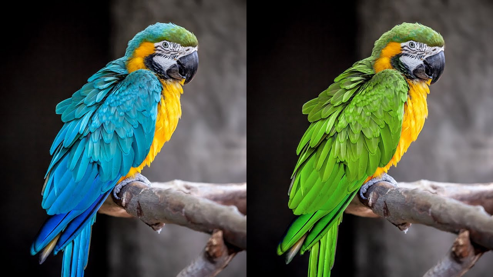

# CgTask

## Result

## Dependencies
 - [glfw](https://www.glfw.org/) for creating windows and contexts
 
 - [Cg](https://developer.nvidia.com/cg-toolkit) for shading
 
 - [stb](https://github.com/nothings/stb/blob/master/README.md) for loading images
 
 ## References
 - An algorithm to convert RGB <==> HSV: [1](https://en.wikipedia.org/wiki/HSL_and_HSV), [2](http://lolengine.net/blog/2013/01/13/fast-rgb-to-hsv), [3](http://lolengine.net/blog/2013/07/27/rgb-to-hsv-in-glsl)
 
